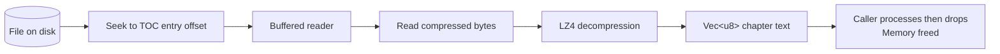

Honzo's streaming API reads and decompresses one chapter at a time. You control when the next chunk is read. The library never pushes data you did not ask for.

## How it works

The streaming reader uses the TOC to seek through the file. Open the file and parse HEAD plus TOC, which takes 48 bytes plus 32 bytes per chunk. Read the TOC entries to find chapter locations and sizes. When the caller requests a chapter, seek to its DATA offset and read plus decompress. Release the buffer after the caller finishes with it.

A 2GB book with 200 chapters uses memory proportional to the largest single chapter at any moment.

## HonzoStream

```rust
use honzo_std::HonzoStream;

let file = std::fs::File::open("massive_book.hzo").unwrap();
let mut stream = HonzoStream::open(file, 1).unwrap();

// Stream through all chapters, one at a time
for chapter in stream.chapters() {
    let (text, _meta) = chapter.unwrap();
    // text is the decompressed chapter content
    // memory is freed when text goes out of scope
    process_chapter(&text);
}
```

## Random access

You are not limited to sequential reads. Any chunk can be read by index:

```rust
// Read chapter 5 directly (zero-based)
let chapter = stream.chunk(5).unwrap();
```

The stream seeks to the correct position and reads only that chunk. Other chunks remain on disk.

## When to use streaming

Large books over 50MB benefit from streaming. It also suits limited memory environments such as embedded devices and mobile browsers. Use it for progressive reading to show the first chapter while the rest stays on disk. It also supports random access to any chapter without scanning the entire file.

## When to use the parser instead

The parser (`HonzoParser`) loads the entire file into memory. Use it when files are small enough to fit in RAM, you need random access to many chunks simultaneously, you are on a platform without `std::fs` (WASM, embedded), or zero-copy access to chunk data matters more than memory footprint.

## Implementation detail

The stream reads chunks through a buffered reader:



## Next Steps

::: grids
::: grid
::: button "Core Concepts" ../getting-started/concepts.md icon:book
:::
::: grid
::: button "Rust API" ../api/rust.md icon:code
:::
:::
