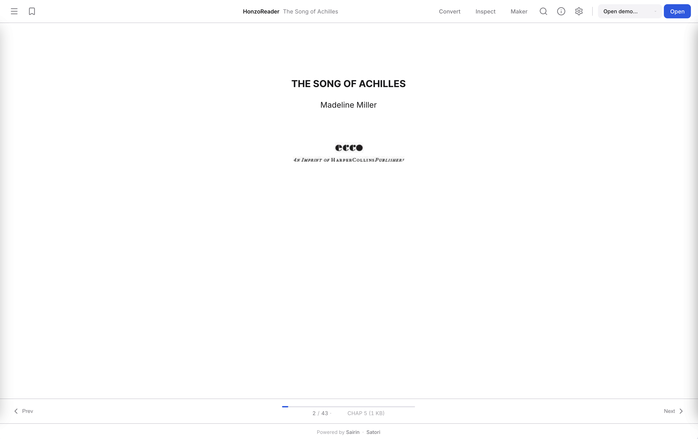

# Honzo

[](https://github.com/Nisoku/Honzo/actions/workflows/lint.yml)
[](https://crates.io/crates/honzo-core)
[](https://www.npmjs.com/package/@nisoku/honzo)
[](LICENSE)

---

The "ideal" ebook format.



Honzo is a binary ebook format designed for simplicity, performance, and portability. Zero-copy parsing, pull-based streaming, per-chunk compression, and portable annotations that travel with the file.

## Features

| Feature                      | Description                                                         |
|------------------------------|---------------------------------------------------------------------|
| **Zero-copy parsing**        | Read without allocating. Embeddable on bare metal.                  |
| **Pull-based streaming**     | Decompress chapters on demand. Never hold the whole book in memory. |
| **Per-chunk compression**    | LZ4 per chapter via TOC flag. Images and fonts store raw.           |
| **Separately editable tail** | META is last. Edit title, tags, revision without touching DATA.     |
| **Portable annotations**     | Highlights, bookmarks, notes stored in the file via EXTRA section.  |
| **Search index**             | Inverted term index as SIDX chunk (MessagePack).                    |
| **Encryption envelope**      | AES-256-GCM per-chunk encryption with X25519 ECDH key exchange.     |
| **Multi-language metadata**  | Titles and descriptions localized per BCP 47 language tag.          |
| **Format conversion**        | Import from EPUB, MOBI, PDF; embedded WASM converter for browsers.  |

## Quick Start

### Rust

```rust
use honzo_core::HonzoParser;
use honzo_io::{HonzoBuilder, HonzoStream};

// Zero-copy parse
let data = std::fs::read("book.hzo").unwrap();
let p = HonzoParser::new(&data, 1).unwrap();
println!("{} chunks", p.head().chunk_count);
for entry in p.toc_entries() {
    println!("  {} - {:?}", entry.chunk_id,
             std::str::from_utf8(&entry.chunk_type));
}

// Streaming read
let file = std::fs::File::open("book.hzo").unwrap();
let mut stream = HonzoStream::open(file, 1).unwrap();
for chapter in stream.chapters() {
    let text = chapter.unwrap();
    println!("Chapter: {} bytes", text.len());
}

// Build
let hzo = HonzoBuilder::new()
    .add_chunk(*b"CHAP", b"Hello, world!", Compression::None,
               MarkupType::Markdown, CoverType::Front, None, None, None)
    .finalize()
    .unwrap();
```

### TypeScript

```typescript
import { createReader, buildHonzo } from '@nisoku/honzo';

const response = await fetch('book.hzo');
const buf = new Uint8Array(await response.arrayBuffer());
const reader = await createReader(buf);
console.log(reader.chunkCount, reader.layoutMode);

const meta = reader.getMeta();
console.log(meta.title?.en);
```

### C

```c
#include "honzo.h"

HonzoHandle* handle = HonzoHandle_parse(data, data_len, 1);
uint32_t count = HonzoHandle_chunk_count(handle);
```

## Repository Layout

```txt
Honzo/
  Cargo.toml                # Rust workspace root
  honzo.ksy                 # Kaitai Struct binary spec
  Build/
    crates/
      honzo-core/           # no_std wire-format parser
      honzo-chunks/         # Chunk types, validation, search index
      honzo-io/             # Builder, reader, stream, DRM (std)
      honzo-convert/        # EPUB/MOBI/PDF/CBZ import
      honzo-c/              # C FFI bindings (Diplomat)
      honzo-wasm/           # WASM bindings
      honzo-cli/            # CLI binary
      honzo-fixtures/       # Test fixture generator
    adapters/typescript/    # npm @nisoku/honzo
  Demo/                     # Vite web demo (reader, maker, inspect, convert)
  Docs/                     # Documentation site (docmd)
  Tests/                    # Integration tests
```

## Documentation

- [Getting Started](https://nisoku.org/Honzo/getting-started/quickstart/)
- [Format Specification](honzo.ksy)
- [API Reference](https://nisoku.org/Honzo/api/)
- [Live Demo](https://nisoku.org/Honzo/demo/)

## Packages

| Language          | Package         | Links                                                    |
|-------------------|-----------------|----------------------------------------------------------|
| Rust (core)       | `honzo-core`    | [crates.io](https://crates.io/crates/honzo-core)         |
| Rust (chunks)     | `honzo-chunks`  | [crates.io](https://crates.io/crates/honzo-chunks)       |
| Rust (io)         | `honzo-io`      | [crates.io](https://crates.io/crates/honzo-io)           |
| Rust (convert)    | `honzo-convert` | [crates.io](https://crates.io/crates/honzo-convert)      |
| Rust (CLI)        | `honzo-cli`     | [crates.io](https://crates.io/crates/honzo-cli)          |
| TypeScript / WASM | `@nisoku/honzo` | [npm](https://www.npmjs.com/package/@nisoku/honzo)       |
| C                 | `honzo-c`       | Source in [`Build/crates/honzo-c`](Build/crates/honzo-c) |

## Contributing

See [CONTRIBUTING.md](CONTRIBUTING.md).

## License

Apache License 2.0. See [LICENSE](LICENSE).
