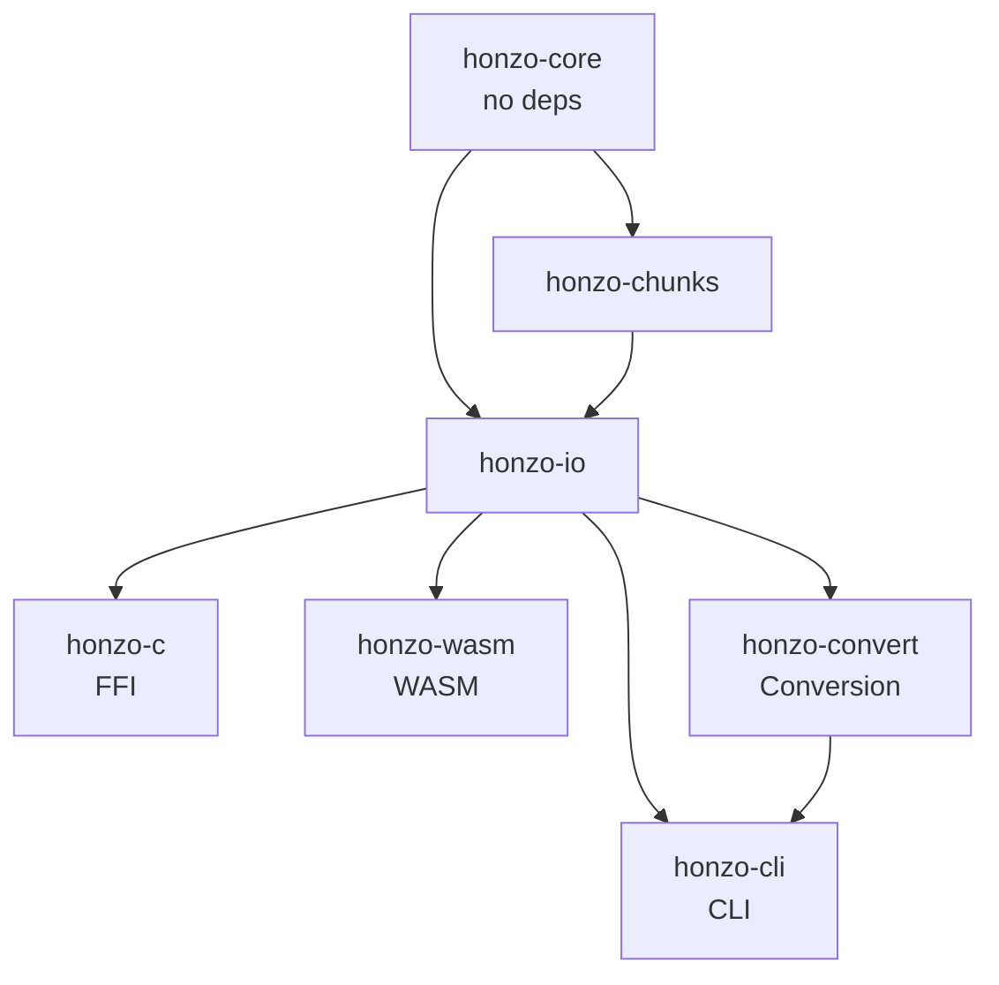
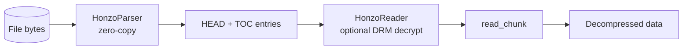
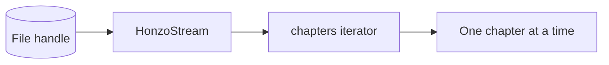
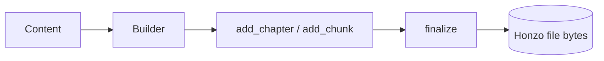

---
title: "Architecture"
description: "The Honzo workspace structure and crate design"
---

## Workspace layout

```txt
Honzo/
  Cargo.toml                    # Rust workspace root
  Build/
    crates/
      honzo-core/               # no_std wire-format + parser
      honzo-chunks/             # Chunk semantics (SIDX, COVT, extras)
      honzo-io/                 # Builder/reader/stream + compression (std)
      honzo-convert/            # epub/mobi/pdf import
      honzo-c/                  # C FFI bindings (Diplomat)
      honzo-wasm/               # WASM target
      honzo-cli/                # CLI binary
    adapters/
      typescript/               # npm @nisoku/honzo
  Demo/                         # Vite web demo
  Docs/                         # Documentation site (docmd)
  Tests/
    fixtures/                   # Sample .hzo files
    corpus/                     # Edge case files
    tests/                      # Rust integration tests
  honzo.ksy                     # Kaitai Struct spec
```

## Crate dependency graph



## Crate responsibilities

### honzo-core

The bottom layer. Defines the Honzo wire format as Rust structs and provides zero-copy parsing. No allocation, no compression, no I/O.

- `parse.rs` -- `HonzoParser` that casts byte slices into HEAD/TOC/EXTRA structs
- `types.rs` -- `HonzoHead`, `TocEntry`, `ExtraEntry`, `HonzoError` types
- `#![no_std]` -- Can be used in embedded and kernel contexts

### honzo-chunks

Chunk type semantics on top of the wire format. Validates and interprets chunk data.

- `data/chap.rs` -- Chapter content validation
- `data/img.rs` -- Image validation and MIME detection
- `data/css.rs` -- CSS parsing validation (via cssparser)
- `data/font.rs` -- Font magic-byte detection and embedding metadata
- `data/covr.rs` -- Cover image helpers
- `data/sidx.rs` -- Search index encoding/decoding
- `data/math.rs` -- Math equation handling
- `extra/anno.rs` -- Annotation types
- `extra/drm.rs` -- DRM envelope types
- `extra/sync.rs` -- Sync track types

### honzo-io

I/O layer with streaming, building, compression, and DRM.

- `reader.rs` -- `HonzoReader` with optional DRM decryption
- `stream.rs` -- `HonzoStream` for pull-based chapter reading
- `writer.rs` -- `Builder` for programmatic file construction
- `crypto.rs` -- AES-256-GCM encryption, ECDH key exchange, HKDF key derivation
- `compress.rs` -- LZ4 compression/decompression

### honzo-convert

Converts existing ebook formats to Honzo.

- `epub.rs` -- EPUB 2/3 conversion (zip extraction, OPF/NCX parsing)
- `mobi.rs` -- MOBI conversion
- `pdf.rs` -- PDF text extraction via pdf_oxide
- `pagebreaks.rs` -- EPUB page break detection and heuristic estimation

### honzo-c

C FFI via Diplomat. Exposes a subset of honzo-core and honzo-io as a C API.

### honzo-wasm

WASM target via wasm-pack. Wraps honzo-core and honzo-io for browser and Node.js.

### honzo-cli

CLI binary with commands: `make`, `info`, `inspect`, `convert`, `validate`.

## Data flow

### Reading



Or with streaming:



### Writing



## Security boundaries

The `no_unsafe` directive is enforced in honzo-chunks with `#![forbid(unsafe_code)]`. Unsafe code is used only in honzo-c for the C FFI boundary and in honzo-core `HonzoParser` for pointer casts. All chunk data is validated before exposure. Encryption uses AES-256-GCM with random nonces and ECDH key exchange.
