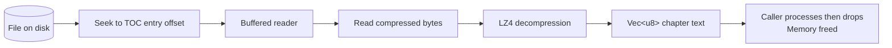

---
title: "Streaming"
description: "Pull-based chapter decoding for minimal memory usage"
---

Honzo's streaming API reads and decompresses one chapter at a time. You control when the next chunk is read. The library never pushes data you did not ask for. Available from Rust, C, and C++.

## How it works

The streaming reader uses the TOC to seek through the file. Open the file and parse HEAD plus TOC, which takes 48 bytes plus 32 bytes per chunk. Read the TOC entries to find chapter locations and sizes. When the caller requests a chapter, seek to its DATA offset and read plus decompress. Release the buffer after the caller finishes with it.

A 2GB book with 200 chapters uses memory proportional to the largest single chapter at any moment.

## HonzoStream

```rust
use honzo_io::HonzoStream;

let file = std::fs::File::open("massive_book.hzo").unwrap();
let mut stream = HonzoStream::open(file, 1).unwrap();

// Stream through all chapters, one at a time
for chapter in stream.chapters() {
    let (text, _meta) = chapter.unwrap();
    // text is the decompressed chapter content
    // memory is freed when text goes out of scope
    process_chapter(&text);
}
```

## Random access

You are not limited to sequential reads. Any chunk can be read by index:

```rust
// Read chapter 5 directly (zero-based)
let chapter = stream.chunk(5).unwrap();
```

The stream seeks to the correct position and reads only that chunk. Other chunks remain on disk.

## When to use streaming

Large books over 50MB benefit from streaming. It also suits limited memory environments such as embedded devices and mobile browsers. Use it for progressive reading to show the first chapter while the rest stays on disk. It also supports random access to any chapter without scanning the entire file.

## When to use the parser instead

The parser (`HonzoParser`) loads the entire file into memory. Use it when files are small enough to fit in RAM, you need random access to many chunks simultaneously, you are on a platform without `std::fs` (WASM), or zero-copy access to chunk data matters more than memory footprint.

## Implementation detail

The stream reads chunks through a buffered reader:



## C / C++ API

The C binding exposes the same streaming pattern via `HonzoFileReader`. All chunk metadata (type tag, content type) is accessible without reading the full chunk data, making it suitable for embedded devices like the ESP32.

```c
#include "HonzoFileReader.h"

DiplomatStringView book_path = {"/sdcard/books/book.hzo", 22};
// reader_version=1: Honzo format v1 (current). Pass the expected format version;
// the library rejects files whose format_version > reader_version.
HonzoFileReader_open_result r =
    HonzoFileReader_open(book_path, 1);
if (!r.is_ok) return;

HonzoFileReader* reader = r.ok;
uint32_t n = HonzoFileReader_chunk_count(reader);

uint32_t chap_tag;
memcpy(&chap_tag, "CHAP", 4);

for (uint32_t i = 0; i < n; i++) {
    uint32_t tag = HonzoFileReader_get_chunk_type(reader, i);
    if (tag != chap_tag) continue;

    HonzoFileReader_get_chunk_result c =
        HonzoFileReader_get_chunk(reader, i);
    if (c.is_ok) {
        process_chapter(c.ok.data, c.ok.len);
    }
}

HonzoFileReader_destroy(reader);
```

The C++ binding in `HonzoFileReader.hpp` wraps the same functions with a destructor-based RAII guard.

### ESP32

The staticlib compiles and links for `xtensa-esp32-espidf`. Build with `--no-default-features` to skip the `image` crate (unsupported on Xtensa LLVM):

```bash
cargo +esp build --release -p honzo-c \
  --target xtensa-esp32-espidf \
  -Zbuild-std=std,panic_abort \
  --no-default-features
```

A minimal C reader links to ~431 KB flash + 2.2 KB static RAM (measured from xtensa-esp32-elf-nm on the linked ELF; confirm on actual hardware if flash budget is tight). Chunks are allocated on the heap one at a time and peak heap scales with the largest chapter, not the total book size. ESP-IDF provides the symbols (`esp_fill_random`, `posix_memalign`, `realpath`) that `std` expects.

## Next Steps

::: grids
::: grid
::: button "Core Concepts" ../getting-started/concepts.md icon:book
:::
::: grid
::: button "Rust API" ../api/rust.md icon:code
:::
:::
