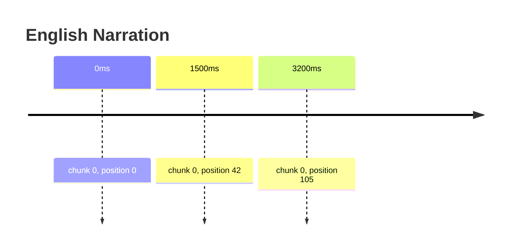

---
title: "Sync Tracks"
description: "Audio, video, and animation synchronization via org.nisoku.sync"
---

The `org.nisoku.sync` EXTRA namespace stores synchronization tracks that map text positions to media timestamps. Use this for read-along, audio books, karaoke, video captions, or page turn sync.

## Sync model

Each sync track is a collection of cues that map a chunk position to a timestamp:



## Data format

Stored as a MessagePack map in the EXTRA entry:

```python
{
  "version": 1,
  "tracks": [
    {
      "id": "track-narration-en",
      "type": "audio",
      "media": "narration_en.mp3",
      "media_duration_ms": 360000,
      "cues": [
        {
          "chunk": 0,
          "position": 0,
          "time_ms": 0
        },
        {
          "chunk": 0,
          "position": 42,
          "time_ms": 1500
        }
      ],
      "metadata": {
        "narrator": "Jane Doe",
        "language": "en"
      }
    }
  ],
  "metadata": {
    "created": "2025-01-15T10:30:00Z",
    "modified": "2025-01-15T10:30:00Z"
  }
}
```

### Cue fields

| Field      | Type  | Description                           |
| ---------- | ----- | ------------------------------------- |
| `chunk`    | `int` | TOC index of the chunk                |
| `position` | `int` | Byte offset within decompressed chunk |
| `time_ms`  | `int` | Timestamp in milliseconds             |

### Track types

| Type        | Description                   |
| ----------- | ----------------------------- |
| `audio`     | Text-to-audio synchronization |
| `video`     | Text-to-video synchronization |
| `animation` | Animation cue points          |
| `page`      | Page turn synchronization     |

## Usage

```rust
use honzo_chunks::sync::{SyncDocument, SyncTrack, SyncCue};

let mut doc = SyncDocument::new();
let mut track = SyncTrack::new("narration-en", SyncType::Audio);

track.add_cue(SyncCue::new(0, 0, 0));
track.add_cue(SyncCue::new(0, 42, 1500));
track.add_cue(SyncCue::new(0, 105, 3200));

doc.add_track(track);
let data = doc.encode().unwrap();
```

### Helper functions

| Function                                                      | Description                     |
| ------------------------------------------------------------- | ------------------------------- |
| `create_audio_cue(chunk, position, time_ms)`                  | Create an audio sync cue        |
| `create_video_cue(chunk, position, time_ms)`                  | Create a video sync cue         |
| `create_page_cue(chunk, position, page_number)`               | Create a page sync cue          |
| `create_media_segment(chunk, position, time_ms, duration_ms)` | Create a segment with duration  |
| `filter_cues_by_type(tracks, type)`                           | Filter cues by sync type        |
| `find_nearest_cue(track, timestamp)`                          | Find cue closest to a timestamp |
| `merge_tracks(tracks...)`                                     | Merge multiple sync track sets  |
| `sort_cues_by_time(track)`                                    | Sort cues by timestamp          |

## Design notes

Positions reference decompressed byte offsets. This approach matches the annotation system.

Multiple tracks allow multiple languages or narrators.

The media file is referenced by identifier. The consuming application resolves the actual media.

Timestamps in milliseconds give approximately 1ms precision. This suffices for audio and video synchronization.
