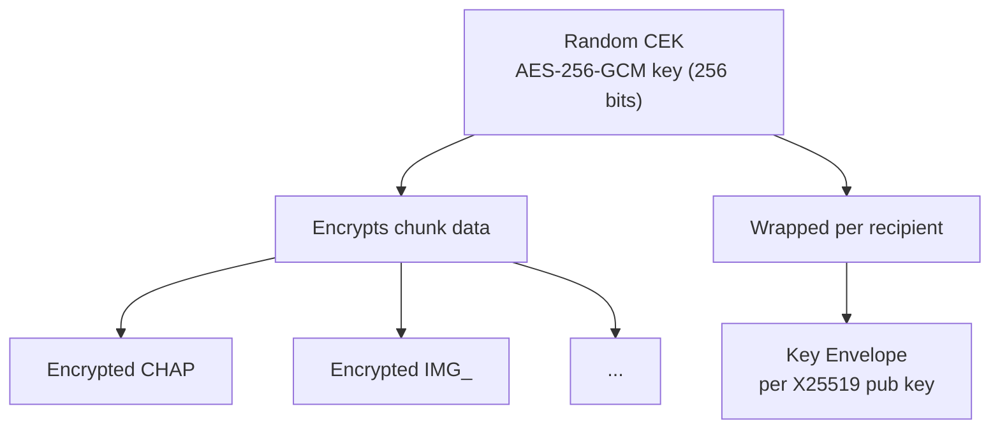

---
title: "DRM & Encryption"
description: "AES-256-GCM content protection with ECDH key exchange"
---

Honzo supports content encryption via an EXTRA entry under the `org.nisoku.drm` namespace. The design separates content encryption from key management. Chapters are encrypted with a random content encryption key (CEK). The CEK is then wrapped for each authorized recipient.

## Model



## Key Envelope

The DRM envelope is a MessagePack map stored in the EXTRA entry:

```python
{
  "version": 1,
  "content_encryption_alg": "AES-256-GCM",
  "key_wrapping_alg": "ECDH-X25519-HKDF-SHA256",
  "license_url": "https://example.com/license/abc123",
  "expiry": "2026-01-01T00:00:00Z",
  "recipients": [
    {
      "ephemeral_pub": "<32 bytes base64>",
      "encrypted_cek": "<48 bytes base64>",
      "recipient_id": "user@example.com"
    }
  ]
}
```

Each recipient gets their own envelope entry. The CEK is wrapped using ECDH with X25519:

::: steps

1. Generate an ephemeral X25519 key pair.
2. Derive a shared secret from the ephemeral private key and the recipient's public key.
3. Use HKDF-SHA256 to expand the shared secret into an AES-256-GCM wrapping key.
4. Encrypt the CEK with AES-256-GCM using the wrapping key and a random nonce.
5. Store the result as `encrypted_cek`: a concatenation of the 32-byte ephemeral public key, 12-byte nonce, encrypted CEK, and 16-byte tag.

:::

## Reading Encrypted Files

```rust
use honzo_io::HonzoReader;

let private_key: [u8; 32] = load_private_key();

let mut reader = HonzoReader::new(&data, 1)
    .with_drm_key(&private_key);
reader.parse().unwrap();

for entry in reader.toc_entries() {
    let chunk_data = reader.read_chunk(&entry).unwrap();
}
```

If a DRM key is not provided, encrypted chunks cannot be read:

```rust
let reader = HonzoReader::new(&data, 1);
reader.parse().unwrap();

match reader.read_chunk(&entry) {
    Err(e) if e.is_drm_error() => {
        println!("This chapter requires a DRM key");
    }
    _ => {}
}
```

## Building Encrypted Files

```rust
use honzo_io::{HonzoBuilder, DrmConfig};

let drm = DrmConfig::new()
    .encrypt_chunks(&[0, 1, 2])
    .add_recipient(&alice_pub_key, "alice@example.com")
    .expiry("2026-01-01T00:00:00Z")
    .license_url("https://example.com/license/abc123");

let hzo = HonzoBuilder::new()
    .with_drm(drm)
    .add_chapter("Chapter 1", ...)
    .add_chapter("Chapter 2", ...)
    .add_chapter("Chapter 3", ...)
    .finalize()
    .unwrap();
```

## Supported Algorithms

| Component          | Algorithm   |
| ------------------ | ----------- |
| Content encryption | AES-256-GCM |
| Key agreement      | X25519 ECDH |
| Key derivation     | HKDF-SHA256 |
| Key wrapping       | AES-256-GCM |
| Random generation  | OS CSPRNG   |

## Next Steps

::: grids
::: grid
::: button "Wire Format" ./wire-format.md icon:binary
:::
::: grid
::: button "Annotations" ../features/annotations.md icon:bookmark
:::
:::
